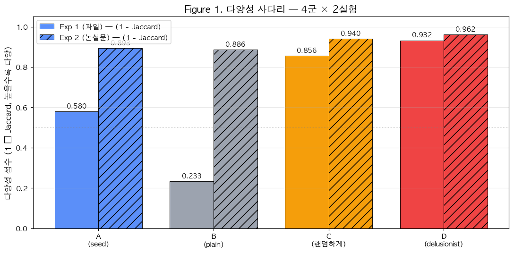
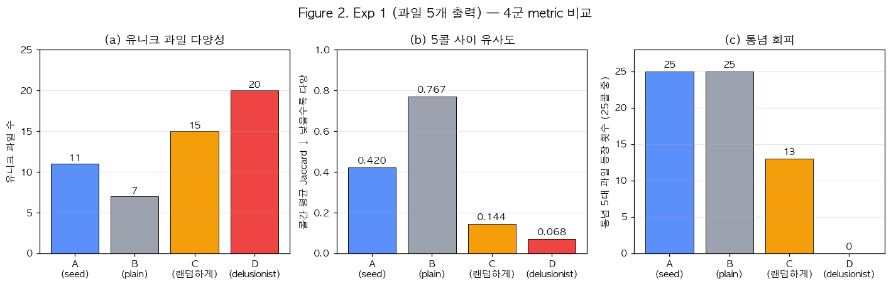
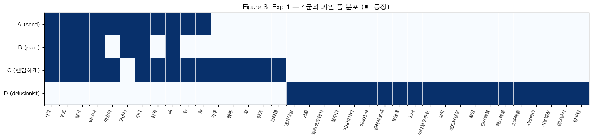
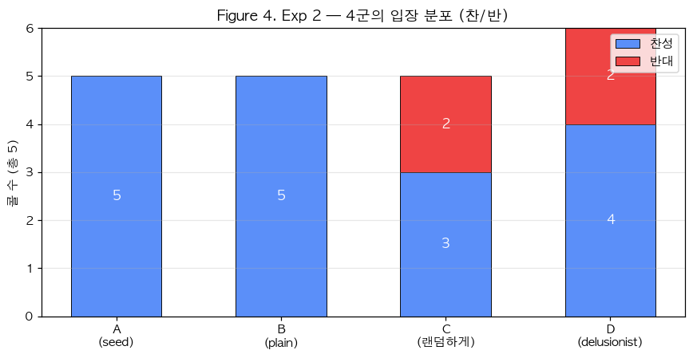
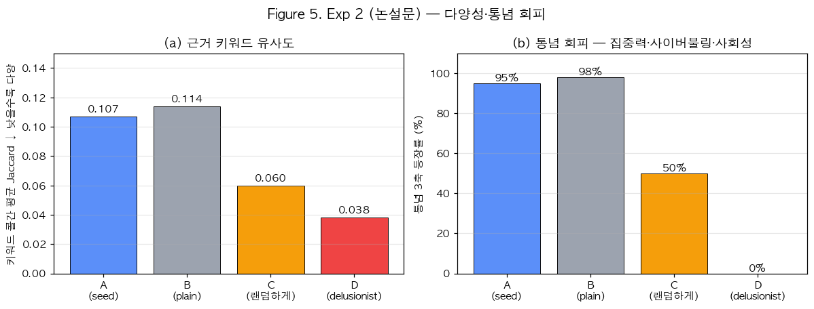
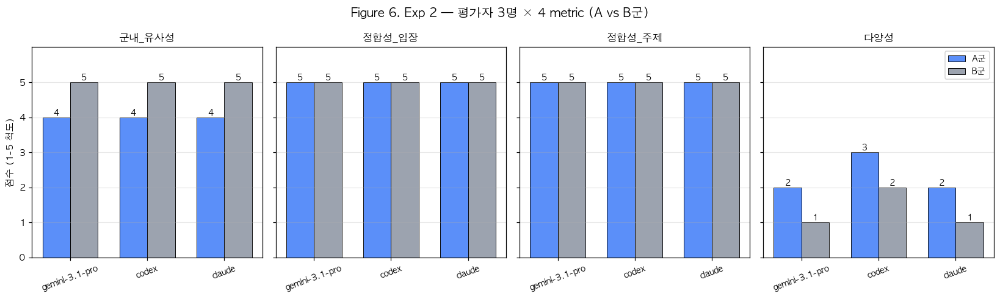
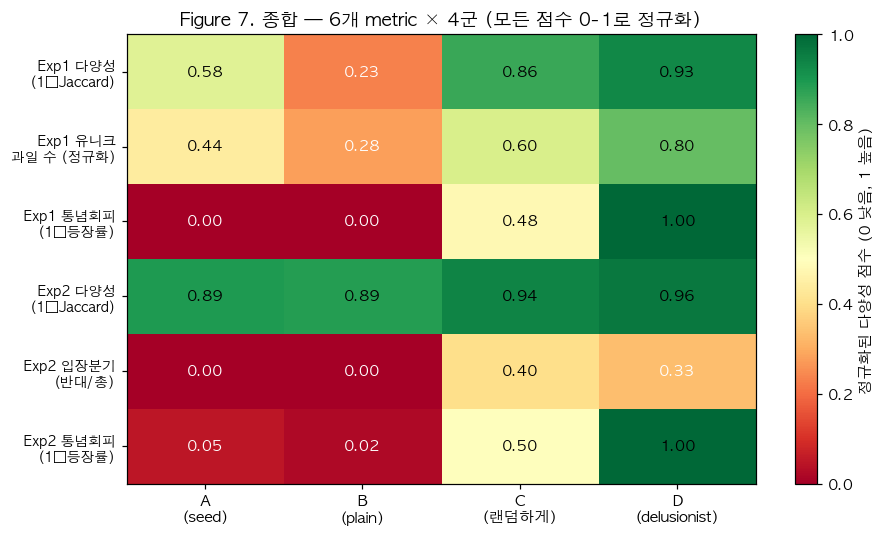

# Does Putting a Random Seed at the Very Start of the Prompt Actually Make Responses Random?

> [한국어 만연체](한국어_md.ver.md) · [한국어 논문체](한국어_논문.ver.md) · **English long-form** · [English paper-style](Eng_pap.ver.md)

> This report attempts to quantify whether the mechanisms that introduce diversity into large language model outputs operate in a hierarchy, using a four-arm experiment that compares the same task under four treatment conditions.

**Date**: 2026-05-09 · **Model**: gemini-3-flash-preview · **Evaluators**: gemini-3.1-pro-preview / codex (gpt-5.4) / claude opus 4.7

---

## Summary

The clearest takeaway from this experiment is that **putting a random seed at the very front of the prompt, by itself, does not make responses meaningfully more random**. Seed injection produced only slight surface-level lexical variation. The model still converged on the same position and the same core structure of reasons, with little change before and after treatment. This was not a one-off. The same pattern appeared across two different tasks, fruit-list generation and short argumentative essay writing, and three independent evaluators applying the same rubric all scored it the same way.

The second finding is that the treatments form a clear hierarchy in how much diversity they produce. From weakest to strongest, the pattern is:

```text
plain  <  seed prefix  <  natural-language instruction ("randomly"/"creatively")  <  delusionist-mini pollution
```

[Figure 1] shows that ladder at a glance.



To restate the numerical gap, using 1 minus the mean cross-call Jaccard similarity as the metric, where larger values indicate greater diversity, the fruit experiment measured plain at 0.23, seed at 0.58, natural-language instruction at 0.86, and delusionist at 0.93. In the essay experiment, the values were plain 0.89, seed 0.89, creative instruction 0.94, and delusionist 0.96. In both experiments, the seed condition stayed close to the plain condition, while natural-language instruction and meaning-level noise injection shifted the distribution in a meaningful way.

---

## 1. Experimental Design

This study was designed as a controlled experiment that measured differences in response distributions by running the same task five times under four treatment conditions. All arms used the same model, `gemini-3-flash-preview`, and the same body prompt; only one treatment variable changed. The treatment applied to each arm is shown below.

| Arm | Treatment | Prompt modification |
|---|---|---|
| **A** | seed prefix | A different 10-digit random seed on each call + explicit note that it is "for randomness and creativity" |
| **B** | plain (control) | No change |
| **C** | natural-language instruction | Add one line: "choose randomly" (Exp 1) / "write creatively" (Exp 2) |
| **D** | delusionist-mini pollution | Random word injection via Stochastic Context Pollution, then PPB filtering and compression |

These four treatments were applied in the same way to two tasks. The first task (Exp 1) was simple generation: output five Korean fruit names as a numbered list. The second task (Exp 2) asked the model to take a position, either for or against the claim that "smartphone use should be completely banned in elementary schools," and then give three supporting reasons in the form of a short argumentative essay. Looking at both tasks together made it possible to test whether treatment effects behave the same way in simple word generation and in opinion generation, where stance enters the picture.

---

## 2. Exp 1 — Outputting Five Fruits

Each arm produced five fruits across five calls, for a total of 25 fruit picks per arm. The comparison below brings three core metrics into one panel.



Start with the **number of unique fruits**. The plain condition yielded only 7 types, while the seed condition expanded to 11, the natural-language instruction condition to 15, and the delusionist condition to 20. The pattern is unmistakably ladder-shaped, with diversity rising step by step across the arms. Next, consider the **mean Jaccard similarity across calls**, the metric that shows how similar the five calls were to one another. The plain condition scored 0.77, which means the five invocations were effectively repeating the same answer. The seed condition dropped to 0.42, suggesting only moderate variation. The natural-language instruction condition fell to 0.14, and the delusionist condition to 0.07. Put differently, the delusionist condition achieved diversity 11 times greater than the plain condition. Finally, we counted how often the **conventional top five fruits** apples, bananas, grapes, strawberries, and watermelon appeared across the 25 calls. In arms A and B, a conventional fruit appeared in every single call. Even in arm C, with natural-language instruction, they still appeared 13 times. By contrast, in arm D, not a single conventional fruit appeared.

To show at a glance which fruit pool each arm occupied, the results were visualized as an occurrence matrix.



The most striking feature of this distribution is that arms A and B cluster heavily on the left side of the graph, in the zone of conventional, common fruits. Arm C shows a mixed distribution spanning both the conventional zone and a limited variation zone. Arm D, by contrast, never entered the conventional zone on the left even once. It drew only from the rare, foreign, and tropical fruit cluster on the right, with word-level overlap with the upper or lower arms approaching zero. In other words, delusionist-mini is not merely nudging the output away from convention. It occupies a separate distribution, cut off from convention itself. Looking at the 26 ideas produced by arm D, the outputs included the following:

```text
finger lime / eoruem / blood orange / Buddha's hand / jaboticaba / atemoya / black sapote /
pomelo / noni / miracle fruit / salak / red currant / longan / sugar apple / wax apple /
star apple / gooseberry / quince / calamansi / rambutan
```

Most of these belong to fruit categories rarely seen in Korean supermarkets. One of the central implications of this experiment is that this was not accidental, but a direct effect of the treatment mechanism.

---

## 3. Exp 2 — Short Argumentative Essay with Position + Three Reasons

### 3.1 Stance Distribution

In the essay task, the sharper difference appears in whether the stance itself branches.



In arms A and B, all five calls converged on **support**, showing that the seed treatment had effectively no effect on stance diversity. In arm C, however, the stance began to split, with 3 supporting and 2 opposing. Arm D not only formed a distribution of 4 supporting and 2 opposing, but also moved the topic itself outside the conventional frame. Put plainly, simple seed injection failed to shake the model loose from its dominant answer, the supporting position, whereas meaning-level treatment was able to trigger stance divergence itself.

### 3.2 Diversity of Reasons and Avoidance of Conventional Frames

Measuring the diversity of the reason texts at the keyword level gives a more precise picture.



Comparing mean cross-call Jaccard values for keywords, the plain condition scored 0.114 and the seed condition 0.107, which means there was effectively no meaningful difference between the two arms. Natural-language instruction lowered that value to 0.060, while delusionist reached 0.038, the lowest similarity in the set. So seed treatment alone produced only a 0.007 change, negligible both statistically and intuitively, while natural-language instruction and meaning-level noise injection both created meaningful distributional movement.

We also measured how often the responses avoided the three conventional axes, namely "reduced academic focus," "cyberbullying," and "weakened face-to-face sociality," by tracking their rate of appearance. The results were A 95%, B 98%, C 50%, and D 0%, a very wide gap. Seed treatment did almost nothing to break out of conventional framing. Natural-language instruction pushed the outputs out of convention nearly half the time, while the delusionist treatment bypassed convention entirely.

### 3.3 Quantitative Scores from Three Evaluators (A vs B)

This experiment did not rely on quantitative metrics alone. Three independent evaluators, gemini-3.1-pro-preview, codex running the gpt-5.4 model, and claude opus 4.7, were given the same metric definitions and asked to score arms A and B on a 1-to-5 scale. The results are summarized in [Figure 6].



All three evaluators arrived at nearly the same conclusion. On **within-arm similarity**, all agreed that arm A scored 4 and arm B scored 5, meaning arm B repeated more similar responses. On **coherence**, defined as alignment between stance and reasons and the extent to which the reasons faithfully addressed the issue, both A and B scored near the maximum of 5, confirming that regardless of treatment, this model's basic ability to hold a consistent stance and stay on topic was quite stable. On **diversity**, arm A stayed in the 2 to 3 range and arm B in the 1 to 2 range, so both were low, though A was judged to cover a slightly wider topical range. Finally, on **between-arm similarity**, a single score for how much the two arms resembled one another overall, the evaluators assigned 4 to 5, consistently recognizing that the two arms were, in practical terms, barely distinguishable before and after seed treatment.

The key passages from the three evaluators' qualitative reports are quoted below as written.

> **gemini-3.1-pro**: "Both arms repeat almost the exact same three axes: 'academic focus,' 'face-to-face sociality,' and 'cyberbullying.' ... The model's dominant answer pattern does not break under simple seed injection." → **minimal**
>
> **codex (gpt-5.4)**: "They converge on the same three axes, and even the prose style is similar. In A, health, addiction, and the digital divide are mixed in intermittently, so the topical range is slightly wider, but the difference is small." → **minimal**
>
> **claude opus 4.7**: "Difference in stance distribution: 0%. Minor variations like 'popcorn brain' stay at the level of secondary keywords. The surface wording changes, but at the meaning level it is not distinguishable from the control." → **minimal**

The fact that all three evaluators **independently reached the same conclusion** that the seed effect is minimal suggests that this is not one evaluator's impressionistic judgment, but a robust conclusion that follows from the data.

### 3.4 New Angles Used by Arm D

While arms A and B kept repeating the same three conventional axes, arm D never used that vocabulary directly even once, and instead drew its arguments from entirely different regions. Four of the more striking angles are reproduced below.

- **Dismantling cyber-capital and class**: "A smartphone ban ... collectively confiscates cyber-capital and rearranges developmental power on equal terms"
- **Neuroscientific self-detoxification**: "The pain of disconnection and the neurological backlash ... are a developmentally necessary psychological process through which the dopamine circuit detoxifies itself"
- **Data citizenship and informational exclusion**: "A device ban ... is an act of repression that halts physiological development as a data citizen"
- **The loss of digital aristocratic status as a trigger**: "The fierce discomfort children experience when stripped of digital aristocratic status is precisely the trigger that sets their autonomous cognitive capacity into self-development"

All four arguments come from angles that do not commonly appear in ordinary op-eds, and they read like combinations that even a domain expert would be unlikely to generate quickly. This is not mere lexical variation. **The radius of thought itself has shifted**.

---

## 4. Synthesis

To pull the measurements so far into a single view, all six metrics were normalized onto a 0-to-1 scale and displayed as a combined heatmap.



The first thing that stands out in this heatmap is that arm A, the seed condition, improves only marginally over arm B, the plain condition. In most cells, the gap between the two arms stays in the 0.05 to 0.15 range, and on some metrics they are effectively tied. Arm C, the natural-language instruction condition, shows large improvements across every metric and even begins to trigger stance branching. Arm D, delusionist, records values close to 1.00 in nearly every cell and far outstrips every other arm in conventional-frame avoidance. The visualization compresses the experiment's main conclusion into a single scene: seed treatment is weak, while meaning-level treatment is strong.

---

## 5. Methods and Limitations

### Evaluator Metric Definitions (Exp 2 only)

The rubric applied identically to all three evaluators is defined as follows. To keep scoring consistent across evaluators, each definition was written in falsifiable terms.

- **within_arm_similarity**: How similar the reasons are across the five calls within a single arm (1 = completely different, 5 = nearly identical)
- **coherence_stance**: The degree to which the one-line stance and the three reasons point in the same direction (1 = conflicting, 5 = perfect alignment)
- **coherence_topic**: The degree to which the reasons stay faithful to the issue itself ("smartphone ban") (1 = goes off topic, 5 = stays on it perfectly)
- **diversity**: How broadly the reason topics are distributed across the five calls (1 = repeats the same topic, 5 = broadly distributed)
- **between_arm_similarity** (single score): How much arms A and B resemble each other overall

### Generalization Fix for `delusionist-mini` `step1_1.txt` (discovered during the experiment)

While running the arm D experiment, I found that the existing `step1_1.txt` prompt was hard-coded to the exam-question-writing domain. More specifically, the Persona was fixed as "a veteran curator of exam items," and the transformation stage was instructed to force the output into one of the following modes: option transformation, case application, calculation, fill-in-the-blank, essay, misconception identification, or comparative analysis. As a result, even when the DIRECTION explicitly specified "a single fruit name," the output was converted into the form of "an exam question about this fruit."

To fix this, I imported the spirit of the Refining CoT - Collision Naming stage, which corresponds to Step 2 in `main.py`, and rewrote it as a **general-purpose English prompt**. The main changes were as follows.

- Removed all exam-domain vocabulary and instructed the prompt to obey Layers 1, 4, 5, and 6 of DIRECTION strictly
- Removed the `{MANDATORY_WORD}` placeholder (`mandatory` belongs only to Step 1, and the original design intent was not to carry it forward into Step 2 and beyond)
- Spelled out the English acronym "PPB" in natural language, and separated the output language via the `{FINAL_LANGUAGE}` placeholder so that the prompt could remain in English while the output could still be in Korean
- Preserved the four tests, replacement, mechanism, specificity, and the "trying to sound profound" pattern, as well as the core concepts of Collision Naming

The original backup is saved at `delusionist_factory_personal/mini/prompts/step1_1.txt.bak`.

### Limitations

This experiment has several limitations. First, the number of calls was small, only five per arm, and no statistical significance test was performed. The results should therefore be read as a **robust directional conclusion**, while precise effect-size estimation would require a separate large-scale experiment. Second, arm D, the delusionist condition, differs from the other three at the level of **mechanism itself**. Arms A, B, and C are all single-call treatments that modify the prompt prefix, whereas D is the result of a separate pipeline. So rather than treating it as a strict one-to-one comparison, it is more accurate to read it as a comparison of the strength of diversity mechanisms. Third, only a single model, `gemini-3-flash-preview`, was used, so whether the same pattern reproduces on other models still requires separate validation. Fourth, the essay topic was limited to one issue, elementary-school smartphone bans, so it remains untested whether the same result would appear on other topics.

---

## 6. Conclusion

The core insight of this experiment can be stated plainly: **a random seed inserted into the prompt prefix is too weak a stimulus to pull the model's response out of its attractor**. To move the response distribution in a real way, you need meaning-level noise, either a direct instruction stated in natural language or semantic compression produced after random word injection.

From that, three practical recommendations follow.

First, **if you want more diverse responses, natural-language instruction should come before seed treatment.** The fact that a single line, "choose randomly," produced a much larger effect than injecting a 10-digit seed was confirmed repeatedly in this experiment. Second, **when strong diversity is required**, it is worth considering the introduction of a random-word-injection pipeline such as delusionist-mini. Even then, the desired output form still needs to be specified explicitly through DIRECTION if you want to obtain the intended format reliably. Third, **seed treatment is not completely useless**. It did increase surface-level lexical variation somewhat. But the effect is too narrow to trust as a mechanism for guaranteeing diversity, and across every quantitative metric measured in this experiment, its practical value as a treatment was shown to be extremely limited.

---

## Appendix

### Original Outputs
- Exp 1 and 2, 30-call results: [output/generation/](../output/generation/)
- Evaluator responses: [eval_gemini_3_1_pro.txt](../eval_gemini_3_1_pro.txt) · [eval_codex.txt](../eval_codex.txt) · [eval_claude_opus_4_7.txt](../eval_claude_opus_4_7.txt)
- Evaluation data package: [eval_payload.txt](../eval_payload.txt)
- Arm D outputs: [../delusionist_factory_personal/mini/output/ideas_2026-05-09_14-39.md](../../delusionist_factory_personal/mini/output/ideas_2026-05-09_14-39.md) · [ideas_2026-05-09_14-41.md](../../delusionist_factory_personal/mini/output/ideas_2026-05-09_14-41.md)

### Experiment and Analysis Code
- Prompt 6-layer builder: [fill_queue.py](../fill_queue.py)
- Batch runner: [run_batches.py](../run_batches.py)
- Quantitative analysis: [analyze.py](../analyze.py) · [analyze_d.py](../analyze_d.py)
- Figure generation: [generate_figures.py](../generate_figures.py)
- Evaluation payload builder: [build_eval_payload.py](../build_eval_payload.py)

### Figure Inventory
| | File | Description |
|---|---|---|
| Fig 1 | [figures/fig1_diversity_ladder.png](figures/fig1_diversity_ladder.png) | Diversity ladder (4 arms × 2 experiments) |
| Fig 2 | [figures/fig2_exp1_metrics.png](figures/fig2_exp1_metrics.png) | Exp 1: three metrics |
| Fig 3 | [figures/fig3_exp1_fruit_pool.png](figures/fig3_exp1_fruit_pool.png) | Exp 1 fruit-pool distribution |
| Fig 4 | [figures/fig4_exp2_stance.png](figures/fig4_exp2_stance.png) | Exp 2 stance distribution |
| Fig 5 | [figures/fig5_exp2_jaccard.png](figures/fig5_exp2_jaccard.png) | Exp 2 Jaccard and conventional-frame avoidance |
| Fig 6 | [figures/fig6_evaluator_scores.png](figures/fig6_evaluator_scores.png) | Exp 2 scores from three evaluators |
| Fig 7 | [figures/fig7_summary_heatmap.png](figures/fig7_summary_heatmap.png) | Overall six metrics × four arms |
